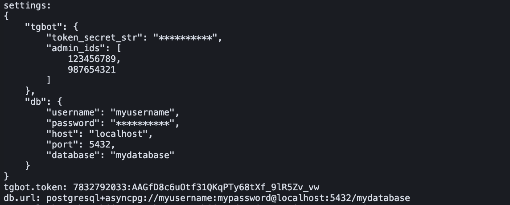

# pydantic_settings_test

# Telegram Bot with PostgreSQL Integration


A template for a Telegram bot with async PostgreSQL connection using Pydantic for configuration management.

## Project Structure
```
pydantic_settings_test/
├── .env # Environment variables
├── settings.py # Configuration module with Pydantic models
└── main.py # Demo script
```


## Configuration

### .env
```ini
# TgBot
TGBOT__TOKEN="7832562033:AAGfD3c5uOtf24QKqPTy91tXf_7lR3Zv_vw"
TGBOT__ADMIN_IDS="[123456789, 987654321]"

# DB
DB__USERNAME="myusername"
DB__PASSWORD="mypassword"
DB__HOST="localhost"
DB__PORT="5432"
DB__DATABASE="mydatabase"
```

### settings.py
```python
from pydantic import SecretStr, Field
from pydantic_settings import BaseSettings, SettingsConfigDict
from typing import List, Optional
from urllib.parse import quote_plus
from functools import lru_cache

class TgBotSettings(BaseSettings):
    token_secret_str: SecretStr = Field(..., alias="token")
    admin_ids: List[int]

    @property
    def token(self) -> str:
        return self.token_secret_str.get_secret_value()

class DatabaseSettings(BaseSettings):
    username: str = "postgres"
    password: Optional[SecretStr] = None
    host: str = "localhost"
    port: int = 5432
    database: str = "postgres"

    @property
    def url(self) -> str:
        password = quote_plus(self.password.get_secret_value())
        return f"postgresql+asyncpg://{self.username}:{password}@{self.host}:{self.port}/{self.database}"

class Settings(BaseSettings):
    tgbot: TgBotSettings
    db: DatabaseSettings

    model_config = SettingsConfigDict(
        env_file=".env",
        env_file_encoding="utf-8",
        env_nested_delimiter="__",
        extra="ignore"
    )

@lru_cache(maxsize=1)
def get_settings() -> Settings:
    return Settings()
```

### main.py
```python
from settings import Settings, get_settings

settings = get_settings()

print("settings:", settings.model_dump_json(indent=4), sep="\n")
print(f"tgbot.token: {settings.tgbot.token}")
print(f"db.url: {settings.db.url}")
```

## Installation & Usage
### 1. Install dependencies:

```bash
pip install pydantic-settings asyncpg python-dotenv
```

### 2. Run the project:

```bash
python main.py
```

## Key Features
- Secure secret storage with SecretStr
- Settings caching via @lru_cache
- Automatic PostgreSQL DSN URL generation
- Multiple bot admin support
- Type-safe configuration with Pydantic

## Screenshot Example

